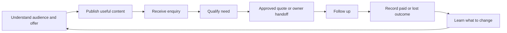

# The promise

> Give Amara your spare phone, your Soko catalogue and internet. She helps answer customers, promote your work, follow up on opportunities and report what business she helped win.

## First customer and first job

First client: **Sanaa Media**, already verified to reach Soko home in an earlier read-only check. First workflow proposed for acceptance: a customer asks about a Sanaa Media service, Amara collects the required specifications, provides approved information, routes a quote or booking decision appropriately, follows up and records the result.

Choose the exact service with the owner before the acceptance run. Do not invent Sanaa Media's stock, margins, turnaround, discount authority or production capacity.

## Experience we owe the owner

- “Customers receive useful attention without me watching the phone.”
- “She remembers what we promised and follows through.”
- “Her marketing sounds like our business and reaches suitable audiences.”
- “I can see what worked, what failed and what needs my decision.”
- “She saves enough time or generates enough contribution to earn her keep.”

## Experience we owe customers and group members

Correct information, relevant participation, consistent context, clear next steps and respectful follow-up. Amara should sound natural without falsely claiming to be a human employee. A group is a community with a purpose, not an advertising inventory. A notification is not permission to advertise.

## Commercial cycle

## Boundaries of the pitch

“Always available” means dependable coverage and transparent interruptions; it does not mean posting constantly or sending outside agreed preferences. “Earns its keep” is a business objective, not consciousness or a threat of death. Revenue, customer trust and owner time matter more than clicks, comments or data volume.

Initial audience: Sanaa Media. Retailers and other service businesses are later hypotheses; a successful pilot does not automatically prove suitability for all African businesses.
