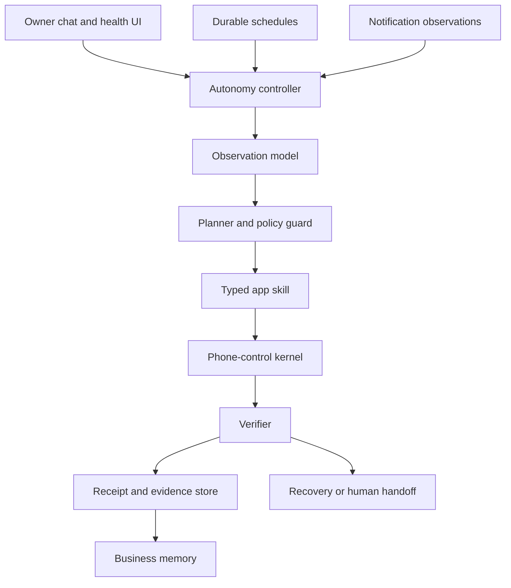

# Target Architecture

## Layers

1. **Intent:** owner chat, recurring instructions, monitored inbound events.
2. **Observation:** package, visible semantic nodes, screenshot reference, screen signature, session/auth state.
3. **Policy:** risk level, required approval, standing-policy match, target validation, idempotency.
4. **Skill:** high-level Soko, WhatsApp, TikTok, or general-app operation.
5. **Kernel:** launch, find, tap, type, scroll, wait, screenshot, backtrack, and interruption control.
6. **Verification:** expected package, target identity, changed fields, visible sent/published state, or precise blocker.
7. **Memory:** task journal, selectors, business facts, approvals, schedules, findings, and side-effect ledger.
8. **Report:** concise outcome, evidence, uncertainty, and next action.

## Non-negotiable invariants

- Model output never directly executes an unregistered action.
- Every side-effecting action has an idempotency key and verification rule.
- A failed verifier means “not verified,” never success.
- Read-only scans may recover automatically; external side effects are never blindly retried.
- Screen text and visual observations retain provenance and timestamps.
- Credentials are referenced by key, not copied into prompts, receipts, or logs.
