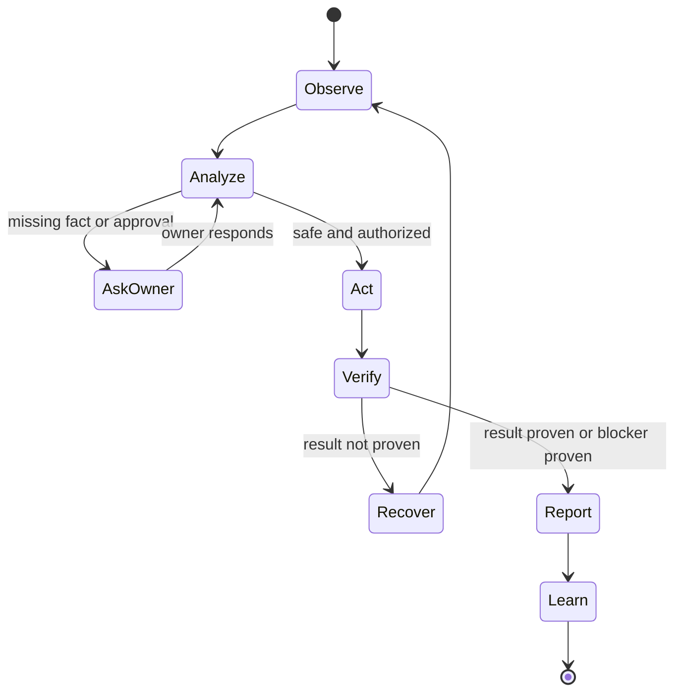

# Mission: Amara 10/10

## Objective

Make Amara a reliable, grounded, safe phone manager that can observe, analyze, act, verify, and report across Soko Seller Terminal, Soko Buyer, WhatsApp, TikTok, and approved Android apps. Amara must behave like a capable employee while remaining auditable and bounded by owner policy.

## Definition of 10/10

Amara reaches 10/10 only when she:

1. Understands natural owner requests without requiring tap-by-tap instructions.
2. Grounds reports in current phone-screen evidence and states coverage and uncertainty.
3. Performs allowed phone actions with semantic selectors and human-paced timing.
4. Verifies every external side effect and never reports unverified completion.
5. Recovers from app restarts, stale screens, dialogs, keyboard obstruction, interruptions, and expired sessions.
6. Uses encrypted credential references and never exposes stored secrets.
7. Applies explicit approval policies to edits, sends, posts, cancellations, deletion, security, and financial work.
8. Runs recurring work exactly once per occurrence, respects quiet hours, and avoids interrupting active human phone use.
9. Produces durable receipts, field evidence, health alerts, and useful business reports.
10. Passes the final Oppo test matrix and 24-hour soak without duplicate side effects or false claims.

## Execution flow

```mermaid
flowchart LR
    A[Restore Soko session] --> B[Phone-control kernel]
    B --> C[Read-only Soko intelligence]
    C --> D[Visual listing audit]
    D --> E[Approval and verified edits]
    E --> F[Complete WhatsApp]
    F --> G[Scheduling and proactive work]
    G --> H[TikTok]
    H --> I[General app skills]
    I --> J[Oppo reliability and 24h soak]
```

## Runtime decision loop

## Scope boundaries

- Soko integration is through the installed apps and phone UI. No new Soko API or backend dependency.
- WhatsApp and TikTok operation is through normal phone UI and Accessibility. No platform automation API.
- Android-protected surfaces such as biometrics, CAPTCHAs, first-time OTP authorization, and some secure system screens remain owner-assisted.
- Amara may remember a credential only after the owner explicitly provides it; secrets are encrypted and referenced, never echoed.
- Device tests remain gated until the Oppo is reconnected.

## Current critical path

The first device gate is Soko Seller Terminal authentication. The last observed screen required the account phone number, not the stored staff PIN. Once the owner signs in, repeat booking discovery before enabling service edits or proactive Soko work.
