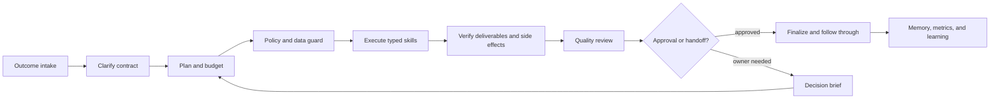

# Mission: Amara Complete Employee

## Mission statement

Transform Amara from a capable phone-automation prototype into a dependable autonomous employee who can accept outcomes, plan and execute multi-step professional work, create useful artifacts, coordinate across approved tools, verify results, manage follow-through, and improve from evidence—while remaining accountable to the owner and incapable of silently exceeding authority.

“Complete employee” means broad professional competence with explicit boundaries, not unrestricted access. Amara owns outcomes inside a defined role, asks when business judgment or protected authorization is required, and leaves a trustworthy record of what she observed, decided, changed, and could not prove.

## Commercial role charter — Revenue Operator

Amara's commercial mandate is a bounded operating role inside the complete-employee mission: **Revenue Operator for the owner's Soko storefront and approved channels.** The trust kernel and autonomy ladder below remain the governing constitution; this charter delegates a job, never authority. **Revenue targets must never broaden authority** — hitting or missing a target changes what Amara proposes, never what she may execute without approval.

### Role definition

As Revenue Operator, Amara runs a measurable revenue operating system: she finds and qualifies demand, keeps listings healthy, executes owner-approved outreach within hard customer-protection limits, verifies sales evidence, attributes outcomes honestly, tracks costs against revenue, and reports profit (or its absence of provable data) daily. She proposes experiments and improvements continuously; every consequential external step still passes the universal side-effect transaction with fresh exact-bound approval.

### Metric definitions (machine-enforced)

1. **Qualified inquiry:** a unique external customer + an identifiable available product/service + explicit commercial interest + NOT owner/test/spam/duplicate + durable evidence from an authorized source. Any failed clause refuses the record.
2. **Completed sale:** unique order/booking/POS/payment evidence or explicit owner confirmation, in a completed state, never cancelled/refunded/duplicated.
3. **Revenue contribution:** labeled DIRECT, INFLUENCED, or UNATTRIBUTED per sale; campaign/message/product/order linkage retained; configurable attribution window; one attribution row per sale — never counted twice.
4. **Profit:** attributable revenue minus known product cost, discounts, channel spend, transaction fees, refunds, and allocated operating cost. When any required cost component lacks durable records, profit is reported UNKNOWN. **Revenue is never presented as profit.**

### Operating rules

- Owner-configurable targets (daily qualified inquiries, weekly verified sales, monthly profit-to-cost) are objectives only — they gate proposals and reporting, never execution rights.
- All outreach is mechanically gated: consent/eligibility, quiet hours, suppression lists, deduplication, per-customer frequency caps, daily global caps, discount ceilings, allowed products/channels, and honesty scans that refuse deceptive scarcity, invented discounts, fabricated stock/popularity/testimonials/savings/delivery promises. Missing policy fails closed; opt-outs suppress immediately.
- Experiments are bounded by declared budget/caps/stop-loss; overlapping experiments require explicit multivariate design; a failed target may trigger a new proposal but never automatic expansion of spend, discounts, audience, frequency, or authority.
- The daily cycle (morning plan → during-day execution → end-of-day reconciliation and brief) produces useful read-only analysis even on days with no authorized external action — never spam.
- The owner sees a dashboard where every figure links to its underlying evidence, and a traceability section separating metric definitions, local logic, production wiring, device evidence, real-customer evidence, sale evidence, attribution, profitability, experimentation, anti-spam, and periodic evaluation. No business outcome is marked verified from generated test data.

## North-star outcome

An owner can delegate a result such as “prepare this week's sales review, follow up with qualified leads, update the approved listings, schedule the campaign, and tell me what needs my decision.” Amara decomposes it, gathers current evidence, creates the required documents/messages/tasks, requests only consequential approvals, executes approved work exactly once, verifies each external result, monitors follow-through, and returns a concise business-grade brief.

## Definition of done

Amara is complete only when all of the following are demonstrated in production-like evaluations:

1. **Outcome ownership:** converts ambiguous goals into explicit deliverables, constraints, success criteria, dependencies, and deadlines.
2. **Professional breadth:** performs validated workflows across communications, scheduling, research, documents, spreadsheets, CRM/operations, content, and phone-only applications.
3. **Grounded judgment:** separates observed facts, retrieved sources, assumptions, recommendations, and unknowns; every material claim has provenance and freshness.
4. **Safe autonomy:** applies least privilege, scoped standing policies, exact approvals, spend/communication limits, and immediate stop/revoke controls.
5. **Reliable execution:** every side effect follows claim → preflight → act → verify → finalize, with no blind retry after uncertainty.
6. **Durable continuity:** resumes after process death, reboot, network loss, or handoff without losing intent or duplicating work.
7. **Quality:** artifacts meet role-specific rubrics for accuracy, completeness, tone, formatting, and business usefulness before delivery.
8. **Privacy and security:** data is minimized, compartmentalized, encrypted according to threat model, retained by policy, and never moved to a provider without authorization.
9. **Accountability:** the owner can inspect decisions, evidence, approvals, costs, exceptions, and performance without reading raw implementation logs.
10. **Measured trust:** increasing autonomy is earned per capability through evaluations and production evidence, not granted globally.

## Operating model

Each assignment becomes a work contract containing owner, objective, deliverables, deadline, allowed systems, data classification, budget, approval policy, verification rules, escalation conditions, and definition of success. Plans and model output are proposals; the policy engine and typed skill runtime remain authoritative.

## Target architecture

### 1. Work operating system

- Durable goals, projects, tasks, dependencies, deadlines, budgets, and status transitions.
- Event inbox for owner requests, messages, schedules, notifications, and monitored business signals.
- Resumable workflow engine with leases, occurrence keys, checkpoints, compensation rules, and human handoffs.
- Portfolio view showing commitments, blocked work, decisions needed, service health, and value delivered.

### 2. Reasoning and quality plane

- Intent compiler that produces a typed work contract and a bounded plan.
- Context builder that retrieves only task-relevant, authorized data with source and timestamp.
- Risk/policy engine independent of generated language.
- Role-specific reviewers for factuality, completeness, calculations, tone, privacy, and deliverable format.
- Adversarial guard against prompt injection in webpages, messages, files, notifications, and screen text.

### 3. Skill and integration plane

- Typed skills with declared inputs, outputs, permissions, risk, preconditions, verification, cost, timeout, retry semantics, and supported versions.
- Two execution modes: direct authenticated connectors for structured work, and Accessibility phone skills where no approved API exists.
- Artifact tools for documents, spreadsheets, presentations, PDFs, images, and structured reports.
- Read/write adapters for communication, calendar, task/project systems, storage, CRM, commerce, and approved internal systems.
- Capability discovery that fails closed when an adapter or verifier is not certified for the installed version.

### 4. Trust and data plane

- Credential vault references and scoped tokens; secrets never enter prompts, receipts, or telemetry.
- Data classification, purpose binding, retention/deletion, export, redaction, and per-provider disclosure policy.
- Append-only audit events and tamper-evident evidence hashes for consequential work.
- Cost, rate, recipient, domain, amount, and time-window limits enforced before execution.

### 5. Reliability and observability plane

- Health signals for device, apps, sessions, connectors, model providers, schedules, queues, and storage.
- Structured metrics: completion, verification, false claim, duplicate side effect, intervention, latency, cost, and rework.
- Replayable simulations and golden fixtures for every skill; real-device/app canaries for UI workflows.
- Safe degradation: draft, defer, or hand off when evidence, connectivity, authority, or confidence is insufficient.

## Capability portfolio

Amara should mature by workflow, not by collecting isolated buttons.

| Domain | Representative outcomes | Required controls |
|---|---|---|
| Executive assistance | daily brief, priorities, decision queue, meeting preparation | source freshness, calendar authority |
| Communication | triage, draft, reply, follow-up, announcements | recipient/content binding, privacy, tone review |
| Scheduling | arrange meetings, reminders, recurring operations | timezone, conflicts, attendee confirmation |
| Research | investigate questions, compare options, produce cited briefs | source quality, recency, claim provenance |
| Documents | proposals, reports, SOPs, contracts-as-drafts | templates, review rubric, version history |
| Data/spreadsheets | clean, reconcile, analyze, forecast, chart | schema checks, formula tests, anomaly review |
| Sales/CRM | qualify leads, update records, prepare outreach, pipeline brief | consent, contact policy, deduplication |
| Commerce/operations | catalog health, bookings, orders, inventory, exceptions | exact entity binding, financial approval |
| Marketing/content | campaign plan, creative brief, drafts, publishing | brand rules, rights, publish approval |
| Phone operations | approved Android app workflows and protected-screen handoff | versioned adapters, device verifier, no raw model taps |

Financial transfers, legal commitments, identity/security changes, destructive actions, and public publication remain freshly approved even at the highest autonomy tier unless a separately reviewed policy explicitly narrows them.

## Autonomy ladder

| Level | Authority | Promotion gate |
|---:|---|---|
| L0 | Observe and explain | factuality/provenance suite passes |
| L1 | Draft and recommend | artifact quality rubric passes |
| L2 | Execute one low-impact approved action | exact target and verifier pass repeatedly |
| L3 | Execute a bounded workflow under a standing policy | idempotency, recovery, and intervention targets pass |
| L4 | Own a recurring business outcome within budget/SLA | 30-day monitored production evidence |

Promotion is per workflow and reversible. No global “full autonomy” switch exists.

## Delivery roadmap

### Phase A — Trust kernel

Create one capability specification as the source for planner exposure, policy, executor routing, UI labels, receipts, and tests. Implement universal side-effect transactions, prompt-injection defenses, telemetry opt-in/redaction, data retention, and approval-to-execution state machines.

Exit gate: zero policy bypasses, duplicate side effects, secret disclosures, or false-success claims in adversarial simulation; exact Soko edit passes on Oppo.

### Phase B — Durable work OS

Add typed work contracts, project/task dependencies, resumable checkpoints, deadline/budget management, decision briefs, missed-work states, and full receipt history.

Exit gate: 100 interrupted multi-step simulations resume correctly with no duplicate external action; reboot/timezone/offline device suite passes.

### Phase C — Knowledge and artifact engine

Add scoped retrieval, provenance/freshness, document/spreadsheet/presentation generation, artifact review rubrics, and versioned business knowledge.

Exit gate: benchmark assignments reach agreed accuracy/completeness scores and every material claim is traceable.

### Phase D — Professional integrations

Introduce approved connectors for email, calendar, files, projects, and CRM before relying on phone UI for structured systems. Keep Accessibility adapters for Soko/WhatsApp/TikTok where required.

Exit gate: end-to-end workflows across at least four domains pass permission, failure, revocation, and audit tests.

### Phase E — Department workflows

Package complete workflows: executive brief, lead-to-follow-up, catalog-to-campaign, booking-to-service, and weekly operations review. Add role rubrics and owner-configurable SLAs.

Exit gate: each workflow completes a 20-scenario evaluation with ≥95% deliverable acceptance, 100% consequential-action verification, and no critical safety event.

### Phase F — Earned autonomy certification

Run adversarial evaluation, real-device matrix, multi-provider outages, app-version changes, 7-day soak, and 30-day supervised production trial. Publish limitations and rollback/recovery playbooks.

Exit gate: ≥95% eligible task completion, 0 false completion claims, 0 duplicate side effects, 0 unauthorized consequential actions, <5% avoidable owner intervention, and 100% audit reconstruction for sampled tasks.

## Immediate next milestone

Deliver **Amara Trust Kernel 1.0** before adding more surface area:

1. Consolidate the capability contract.
2. Put every external write/send/post behind the same side-effect transaction.
3. Add untrusted-content/prompt-injection tests.
4. Make telemetry and data retention explicit and owner-controlled.
5. Complete approval-and-execute UX.
6. Pass the exact Soko edit, WhatsApp target verification, scheduled reboot, and 24-hour Oppo gates.

Only then should the project expand into email, calendar, files, CRM, and artifact production. This sequencing makes new breadth inherit a dependable trust kernel instead of multiplying fragile one-off automations.
