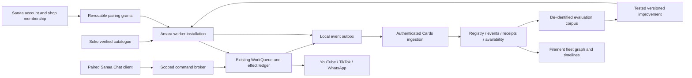

# Architecture: extend existing worker and Cards

## Identity and tenancy

Keep AgentDevice's server primary key as the registry reference. Distinguish stable registration, installation UUID, rotating device credential, boot ID, authenticated user, tenant and verified shop binding revision. Android ID/IP/label is not an authentication factor. App reinstall is a new installation requiring explicit relink; avoid silently merging receipt histories. Restore backups without reactivating revoked credentials. A shop change creates an auditable binding revision with effective timestamps.

Existing admin role checks must evolve into explicit policies: fleet superadmin, scoped support reader, shop admin, paired command client, worker. Worker token writes only its own events, fetches only its own config/commands, and cannot list fleet records. Server derives tenant/shop from the binding and rejects a conflicting client claim. A user can own several shops and devices; selecting a shop is mandatory for scoped actions. Provisioning after Soko onboarding creates a pending worker invitation, not an active hardware worker or permission grant.

## Storage and events

Extend AgentLog/AgentHeartbeat or migrate them into normalized event/receipt tables with compatibility adapters; do not maintain contradictory totals. Add unique `(agent_device_id, installation_id, event_id)`, indexes for tenant/time/device/job/status and outbox delivery cursor. Store server ingestion time separately from event time. Events are immutable; reconciliation is a new event referencing the old one. Retain policy/review state independently of audit retention.

Phone outbox and work ledger should commit atomically where possible; otherwise derive idempotent events from durable ledger changes with a recovery cursor. Batch uploads are bounded with per-event acknowledgements; retry only unacknowledged IDs with backoff/jitter, handling 401/403/413/429/5xx distinctly. Never block the screen executor on telemetry. Reserve capacity for receipts, command decisions and critical health changes; coalesce repeated unchanged observations. Expose dropped/coalesced diagnostic counts, spool pressure and oldest unacknowledged age. A full spool cannot erase an uncertain-send record.

Proposed starting limits, to validate on both devices: heartbeat every five minutes while reporting consent and lifecycle policy permit, immediate major state changes, 50 events/128 KiB per batch, seven days/25 MiB local telemetry budget. Backend 30-day detailed diagnostics, 90-day work outcomes, one-year aggregates; owner policy/deletion/operational needs may require changes. Do not purge unacknowledged critical receipts without a visible data-loss alarm and documented recovery policy.

## Availability and metrics

Maintain separate fields for worker owner On/Off, process liveness, accessibility readiness, validated internet, backend reachability, power/charging/thermal, permission state, shop session and platform capabilities. Last seen ages into stale after three expected heartbeats (initial 15 minutes); label it unreachable/unknown, never infer physical shutdown. Graceful Off/shutdown can emit a best-effort event if consent permits. Abrupt power loss cannot report itself; distinguish explicit Off, observed recovery and inferred gap. Out-of-order offline uploads update historical timeline, not current liveness.

Calculate: eligible jobs, attempts, verified external actions, partials, failures, deferrals, uncertain actions, queue age, execution/reply latency p50/p95, retries per job, availability observed coverage, spool lag, and crash/ANR rate when measurable. Do not sum repeated heartbeat 24h counters. Availability denominator excludes unobserved periods or shows coverage. Zero jobs gives N/A success rate. Content views/engagement/conversions are separate delayed observations with source and sampled_at; unavailable means unknown, and correlation does not establish sales causation.

## Admin map

Default graph is account → shop → worker → paired clients/platform accounts. Edges describe authorized relationships, not geographic location or peer trust. Provide a searchable accessible list alternative, filtered graph, pagination and lazy detail loading. Geography is optional later with explicit location consent; never infer coordinates from ADB IPs.

Node card: label/model/build, last seen, owner state, observed readiness, battery/charging, internet/backend status, queue/review count, last verified action and sync lag. Detail tabs: timeline; jobs/attempts/receipts; health and availability; media and platform notices; pairings/permissions; configuration desired/applied revision; learning version; admin audit. Drill-down carries the same date range and tenant filter. Every color state has text and timestamp.

## Remote control and learning

Initial broker uses authenticated bounded polling compatible with current HTTP stack; push is a wake-up hint only. No direct ADB, open shell or unrestricted remote code endpoint. Route commands through WorkQueue and SideEffectRunner, not a second executor. Local owner Off always prevents work, including queued commands. Chat-generated text is untrusted input until parsed to a typed, authorized command; content from messages/web/catalogue cannot grant new scopes.

Sharing improvement evidence requires its own consent and redaction. Cluster by app version, OS/vendor, language, permission state and recipe version. Prefer successful semantic UI strategies and test fixtures, not device coordinates or private conversation memory. Candidate → offline replay → shadow evaluation → compatible-device canary → reviewed signed release → observed rollout → rollback. No automatic model training or self-modifying executable code is implied by storing JSON. Model training is a later separately governed use of appropriately consented data.

## Storage engine decision

DATABASE_DECISION.md is authoritative for storage implementation: existing Cards PostgreSQL with typed relational envelope columns and bounded JSONB facts. Keep Soko's separate MySQL connection read-only. Use existing database queues/cache until measured contention justifies a change; authenticated polling before optional Reverb. No Firebase or MongoDB replacement in this mission.
