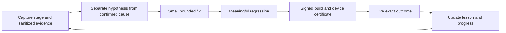

# Learning and recovery rules

| Symptom | Confirmed cause / uncertainty | Fix | Regression / next observation |
|---|---|---|---|
| Sound row tap rejected | Decorative children changed | Stable identity plus fresh geometry | Decoration change accepted; artist change rejected |
| Picker stalls | Missing window observed; precise cause still open | Bounded waits, progress stages, frame diagnostics | Stop before dispatch; inspect failure categories |
| Source queue cannot find receipt | Scrubber changed numeric identity | Preserve identity; deterministic legacy lookup | Conflicting receipts stay uncertain |
| Export points at wrong ad | Newer posts displaced queued source | Bounded exact-caption own-profile search | Older recent source selected, unrelated source rejected |
| Channel not recognized | Combined labels / delayed rendering suspected | Split label lines; bounded wait | Live exact channel check pending |
| WhatsApp missing on video | Scheduled builder used empty fallback | Use configured public ad contact | Serialization and creative-fingerprint tests |
| Ten-minute posts drift | Interval restarted at completion | Anchor next due to prior slot | Render delay and missed-slot regressions |
| Access drops after OS changes | ColorOS service lifecycle | Owner Settings popup and bound-state check | Permission toggle alone is not readiness evidence |

## Learning cycle

This is a documented improvement process, not a claim that the app rewrites or deploys its own code. Runtime recovery may retry reversible preparation within deadlines; it must preserve owner power and cannot learn to bypass permissions, infer publication success, or replay uncertain side effects. Repeated unknown failures require evidence and a reviewed fix.

## Live cadence observation on release 35

After deployment, the pending TikTok opportunity was held until device timestamp 1789918070487 (about 18:27:50 local). Journal blockers explicitly included `Kind TIKTOK_POST_PUBLISH is circuit-broken`, alongside an earlier `composer_foreground` preparation failure. Therefore there are two distinct timing causes: completion-based drift (fixed) and cooldown after failures (still intentional). Changing the interval cannot safely override a circuit breaker. Fix and verify its underlying failure; do not delete its ledger state to create an apparent scheduling success.
