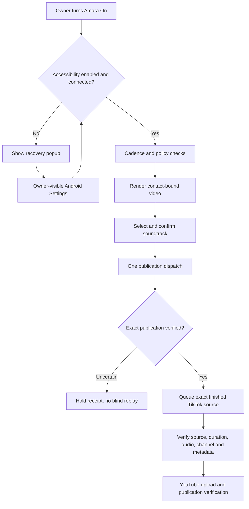

# OPPO publishing and recovery mission

Status: active. Date: 2026-09-20. Parent: [platform reliability](../amara-platform-reliability-20260920/MISSION.md).

Deliver a replacement release on the OPPO CPH1933 that restores public WhatsApp contact on new ads, keeps scheduled posting on its interval grid, handles TikTok soundtrack selection safely, and publishes a verified YouTube Short from the exact finished TikTok source. Add owner-visible Accessibility recovery and preserve app data and uncertain publication receipts.

Owner approved YouTube channel `@sanaasanaa1774` and soundtrack reuse for the final test. Public ad contact was checked in Settings. Do not derive it from private owner or manager contacts. The owner subsequently authorized replacement installation, permission recovery and device-specific readiness checks on TPS450M; publishing authorization remains bound to the confirmed destination account.

## Navigation

- [Plan and acceptance](PLAN.md)
- [Session record and fixes](SESSION.md)
- [Other-agent tasks](HANDOFF.md)
- [Learning and recovery rules](LESSONS.md)
- [Machine-readable progress](progress.json)
- Run `python3 mission/amara-oppo-recovery-20260920/scripts/check_progress.py` from the repository root.

## Flow

Progress states separate source implementation, tests, installation and live acceptance. A successful build is never publication evidence. Device certificates are snapshots, not permanent guarantees.
